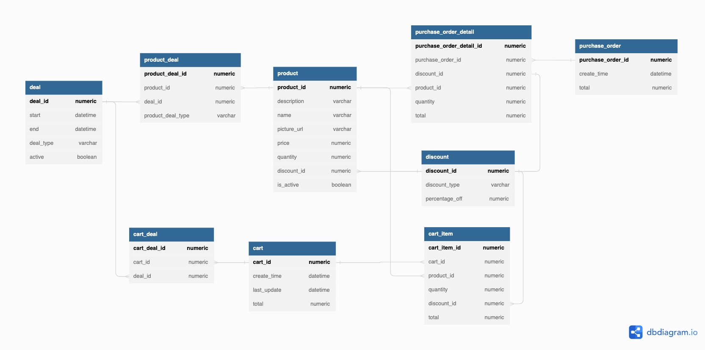

# E-Commerce back-end application built in Java and Spring Boot

[Bullish Technical Assessment (1).pdf](https://github.com/raghu13590/ecommerce/files/9770963/Bullish.Technical.Assessment.1.pdf)

## Requirements</br>
Java 11<br/>
Gradle 5

## Commands</br>
starting the application 
```
./gradlew bootRun
```
running unit tests
```
./gradlew test
```

## Database schema


## REST end points documentation
[SwaggerUI](docs/ecommerceSwaggerUI.pdf)
